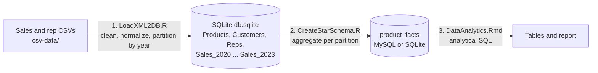
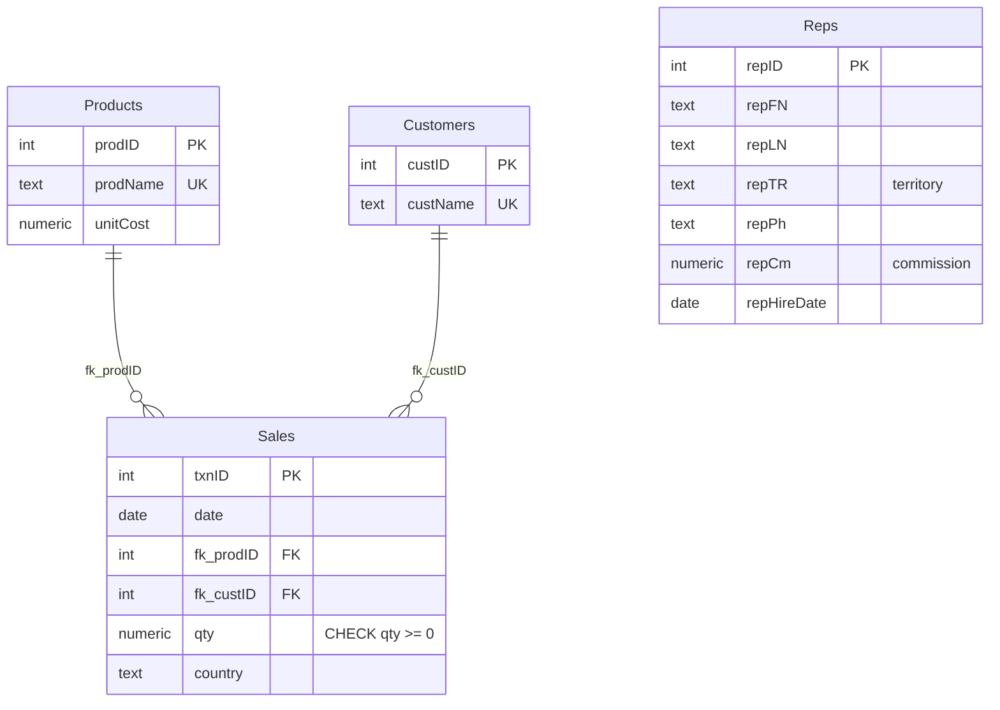

# Pharma Sales Star Schema (R, SQLite, MySQL)
### Project for CS3200: Introduction to Databases SEC 02 S2 2024

An ETL pipeline and analytics warehouse for pharmaceutical sales data. It loads raw transaction CSVs into a normalized relational database, aggregates them into a star-schema fact table, and answers business questions with SQL.

**The data:** about 25,500 sales transactions (2020-2023) across 12 products, 17 customers, 8 sales reps and 6 countries.

## Architecture



| Step | File | What it does |
|------|------|--------------|
| 1 | `LoadXML2DB.QuinnB.R` | Creates the normalized SQLite schema with keys and constraints, converts dates, assigns IDs, loads the CSV batches, then splits `Sales` into one table per year |
| 2 | `CreateStarSchema.QuinnB.R` | Aggregates each yearly partition into a `product_facts` fact table in MySQL |
| 3 | `DataAnalytics.QuinnB.Rmd` | R Notebook that runs analytical SQL against the fact table and renders the results |
| - | `star_schema.sql`, `analytics_queries.sql` | The same fact-table build and queries in plain SQL, so the analysis can be reproduced in SQLite without MySQL |

## Data model

**Normalized operational database (SQLite):**



`Sales` is partitioned into `Sales_2020` through `Sales_2023`, one table per year with the same columns, to keep date-range queries small.

**Star schema:** a single fact table at the grain of product x month x year x country, with the measures `totalAmount` (quantity x unit cost) and `totalUnits`:

```
product_facts(prodName, month, year, country, totalAmount, totalUnits)
PRIMARY KEY (prodName, month, year, country)
```

Pre-aggregating makes analytical queries scans over about 3,200 rows instead of 25,500 transactions, and the totals reconcile exactly with the source (26,653,700 units in both).

## Sample queries and results

```sql
-- Q1: total amount sold in each month of 2022 for 'Clobromizen'
SELECT month, ROUND(SUM(totalAmount), 2) AS totalAmountSold
FROM product_facts
WHERE year = 2022 AND prodName = 'Clobromizen'
GROUP BY month ORDER BY month;
```

| month | 1 | 2 | 3 | 4 | 5 | 6 | 7 | 8 | 9 | 10 | 11 | 12 |
|-------|---|---|---|---|---|---|---|---|---|----|----|----|
| totalAmountSold | 53,568 | 104,112 | 118,800 | 108,144 | 119,232 | 90,432 | 108,432 | 128,880 | 110,304 | 74,592 | 97,200 | 60,048 |

```sql
-- Q2: units sold in Brazil each year for 'Xipralofen'
SELECT year, SUM(totalUnits) AS totalUnitsSold
FROM product_facts
WHERE country = 'Brazil' AND prodName = 'Xipralofen'
GROUP BY year ORDER BY year;
```

| year | 2020 | 2021 | 2022 | 2023 |
|------|------|------|------|------|
| totalUnitsSold | 45,300 | 88,000 | 87,600 | 49,100 |

```sql
-- Q3 (bonus): top 5 products by revenue across all years
SELECT prodName, ROUND(SUM(totalAmount), 2) AS revenue, SUM(totalUnits) AS units
FROM product_facts GROUP BY prodName ORDER BY revenue DESC LIMIT 5;
```

| prodName | revenue | units |
|----------|---------|-------|
| Zalofen | 90,179,700 | 2,312,300 |
| Bhiktarvizem | 9,442,800 | 2,440,000 |
| Xinoprozen | 6,786,612 | 2,406,600 |
| Xipralofen | 5,777,688 | 1,213,800 |
| Proxinostat | 5,337,951 | 2,393,700 |

Results above were computed with `star_schema.sql` and `analytics_queries.sql` on the project's database.

## Running it

Requires R with `DBI`, `RSQLite`, `RMySQL`, `dplyr`, `readr`, `lubridate`, `kableExtra` (installed by `pacman` in the scripts).

1. Put the source CSVs in `csv-data/` (not included; they were provided by the course).
2. Run `LoadXML2DB.QuinnB.R` to create `db.sqlite`.
3. **Without MySQL:** build the fact table and run the queries directly in SQLite:
   ```
   sqlite3 db.sqlite < star_schema.sql
   sqlite3 -header -column db.sqlite < analytics_queries.sql
   ```
4. **With MySQL (the original setup):** set the connection as environment variables, then run `CreateStarSchema.QuinnB.R` and knit `DataAnalytics.QuinnB.Rmd`:
   ```
   DB_HOST=... DB_NAME=... DB_USER=... DB_PASSWORD=... DB_PORT=3306
   ```

## Skills shown
Relational schema design and normalization, ETL in R, table partitioning, dimensional modeling (star schema), SQL aggregation and validation, reproducible reporting with R Markdown.
